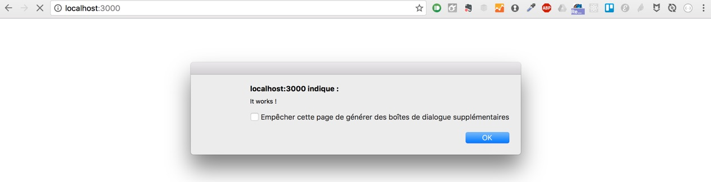

**Bonjour à tous,**

Nous entrons dans le cycle de découverte du backend, avec Meteor. Cette section de 4 semaines va vous emmener dans la découverte d'un aspect primordial du javascript, l' ES6. Cette dernière mouture du langage propose quelques nouveautés syntaxiques qui vont nous aider à rendre notre code plus maintenable, et compréhensible.

## Ce que nous allons construire

Pendant les 4 prochaines semaines nous allons construire notre propre version du cookie clicker. C'est un projet que nous allons gérer comme des pros, avec toutes les bonnes pratiques nécessaires :)

Nous allons notament voir :

* Comment analyser les besoins de notre application.
* Comment utiliser Git pour gérer ce projet
* Organisation des fichiers / dossiers
* Comment ES6 va nous être utile
* Comment créer les premières fonctionnalités
* Comment refactorer ces premières fonctionnalités.

Cette structure sera utilisée chaque semaine, jusqu'à ce que nous ayons terminé l'application.

## Commencer le projet

Avant de nous lancer dans la création de code, ou de notre projet meteor, nous allons analyser le jeu Cookie Clicker, pour lister les fonctionnalités dont nous aurons besoin. Nous allons répartir ces fonctionnalités dans les différentes zones de notre app, pour commencer.

[Voir le jeu](http://orteil.dashnet.org/cookieclicker/)

#### La zone de score

Cette zone est la plus à gauche, et doit afficher plusieurs informations.

* Le nom de l'usine
* Le score
* Le nombre de cookies par seconde
* Un bouton cookie pour augmenter le score

#### La zone de notifications

Cette zone est au milieu, et n'a pour seule fonction que de fournir des indications visuelles sur ce que possède l'utilisateur, ou bien sur ce qu'il vient de débloquer. On peut donc affihcer dans cette zone des notifications pour donner à l'utilisateur un feedback sur son avancement.

#### La zone du store

C'est donc la toute dernière zone, complètement à droite. Cette zone a un double objectif. Permettre à l'utilisateur d'acheter des éléments, et surtout voir en un regard l'intérêt que possède tel ou tel fonctionnalité en lui donnant des statistiques sur ce que lui rapporte un élément.

## Préparer le projet Meteor

Nous allons utiliser Meteor pour réaliser cette application.

[Pour installer meteor](https://www.meteor.com/install)

Une fois meteor installé sur votre machine, vous allez créer un dossier dans lequel nous rangerons tous nos projets meteor.

Nous allons dorénavant faire toutes les manipulations depuis un terminal. Dans un terminal donc, tapez les commandes suivantes

```
cd /
mkdir Meteor
cd Meteor
```

* La commande cd / vous permet de vous déplacer dans le repertoire utlisateur de votre machine
* mkdir Meteor créé un dossier appelé Meteor
* cd meteor vous place à l'interieur de ce dossier.

Pour initialiser un projet meteor, nous allons taper :

``` meteor create cookieclicker ```

Cette commande va initier un projet meteor, et créer un dossier du même nom.

Pour nous rendre à l'interieur de ce dossier, il suffit de taper

```cd cookieclicker```

Comme c'est la première fois que nous utilisons ce projet, nous allons installer les dépendances Node à l'aide de la commande

```meteor npm install```

Puis, pour lancer le serveur et voir notre application, il nous suffit de taper

``` meteor ```

Cette action va faire en sorte que meteor pré configure un tas de chose pour nous, et lance un serveur local contenant notre site internet.

Pour arrêter le serveur, il suffit de faire ```Ctrl + C```.

#### Initier Git

Pour commencer à tracker notre projet avec Git, il suffit de taper

```git init```

 Meteor a automatiquement créé un fichier .gitignore. Ce fichier permet de lister les fichiers ou repertoires que git doit ignorer. Par défaut, ce fichier est prérempli pour ignorer le dossier Node Modules. C'est une bonne chose, puisque ce dossier est généré à l'aide de NPM INSTALL.

 #### La structure de dossiers et fichiers.

 Nous allons mettre en place dés maintenant une structure organisationnelle pour notre code.

 Pour ce faire, nous allons supprimer **TOUS** les fichiers et dossiers **SAUF** les suivants :
* .meteor
* .git
* .gitignore
* package.json

Nous allons ensuite créer les répertoires et fichiers suivants :

* client
  * index.html
  * index.js
* public
  * img
* imports
  * startup
    * client.js
  * components
  * containers
  * ui
    * body.html
    * body.js

## Premier commit

Maintenant que nous avons notre structure de base, nous allons faire notre premier commit. Pour rappel, un commit est un "instantanné" de notre code. Une sauvegarde à un instant t de l'état de notre travail.

Pour vérifier ce qui est suivi ou non par git nous pouvons taper la commande ```git status```.

On peut voir que nos changements sont en rouge, et que donc notre travail n'est pas enregistré par git.

```git add .```
Cette commande ajoute à git tout ce qui se trouve dans le repertoire actuel du terminal

```git commit -m"Création de la structure des dossiers"```

Cette commande créé un commit, et enregistre donc l'état des fichiers. On y ajoute un message, à l'aide du **-m"Création de la structure des dossiers"**

Les messages que l'on ajoute sont par convention écris au présent, et décrivent précisement ce qui a changé depuis le dernier commit.

## Notre premier code ES6

Nous allons découvrir le principe des imports export en ES6. Ce principe est très proche de celui utilisé par Node pour l'utilisation de ses paquets.

> #### Note
> Par défaut Meteor charge automatiquement tout fichier que ce soit javascript ou css. C'est un comportement utile en période de test et de développement, mais absolument non souhaité lorsque l'on souhaite créer un site optimal.

Heureusment, il existe une solution pour palier à ce problème, le dossier **import**.

> Tout ce qui est placé à l'intérieur de ce dossier n'est PAS chargé, à moins d'être appelé explicitement.

Dans le fichier index.js du dossier client, nous allons importer le code depuis notre dossier imports.

```javascript
import '/imports/startup/client';
```

Ce code va permettre à notre javascript côté client de récupérer le code dont nous allons avoir besoin.

Presque tout le code que nous écrirons se trouvera dans le dossier import. Cela nous permettra de l'appeler quand et si besoin, que ce soit depuis le client ou le serveur.

Nous allons maintenant, pour nous assurer que notre fichier est bien chargé, ajouter une petite ligne de code dans le fichiers /imports/startup/client.js

```javascript
alert('It works!');
```

Dans la console, si ça n'est pas déjà fait, tapez **meteor** afin de lancer le serveur local, et rendez vous sur la page http://localhost:3000 pour voir votre travail.


Nous allons donc pouvoir commencer à coder notre projet.

## Objectifs de la semaine

* Choisir le framework Semantic UI et l'utiliser avec Meteor
* Découverte de Blaze
* Créer une structure HTML basique du site à l'aide de Blaze

Pour utiliser Semantic UI, il suffit une fois que vous avez décompressé les fichiers de placer les fichiers css et js dans le dossier client. Pour qu'ils soient appelés en premier, vous pouvez soit les renommer avec un _ en premier caractère, soit les placer dans un dossier dont le nom commence par _ aussi.

Dans le dossier public de notre app, placez le dossier **themes** afin qu'il soit accessible et que les icones du framework fonctionnent.


A l'intérieur de body.html (dans imports/ui) ajoutez le code suivant :

```html
<body>
  <div>
    <header>
      <h1>Store</h1>
    </header>

    <ul>
      {{#each storeElements}}
        {{> storeElement}}
      {{/each}}
    </ul>
  </div>
</body>

<template name="storeElement">
  <li>{{titre}}</li>
</template>
```

Dans le fichier body.js (dans imports/ui) doit lui contenir ce code :

```javascript
import { Template } from 'meteor/templating';
import './body.html';

Template.body.helpers({
  storeElements: [
    { titre: 'Curseur' },
    { titre: 'Grand mère' },
    { titre: 'Ferme'}
  ],
});
```

Pour que ce code soit pris en compte et chargé dans notre application, nous devons l'importer dans notre client.

Notre client charge déjà par défaut le contenu du fichier client.js dans imports/startup. Il nous suffit donc de modifier ce fichier pour qu'il appelle notre premier template. Nous pouvons en profiter pour supprimer l'alert que nous y avons placé.

Le fichier client.js doit désormais ressembler à ça.

```javascript
import '/imports/ui/body.js';
```

Tapons **meteor** dans le terminal si votre serveur n'est pas déjà lancé, et allons vérifier notre site.

Vous devriez y voir apparaitre une liste avec les premiers éléments de notre store.
