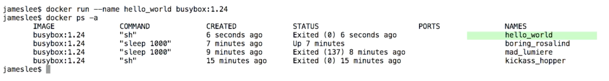
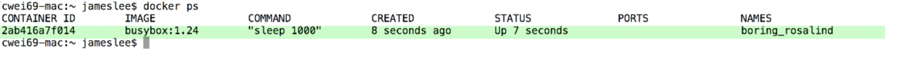
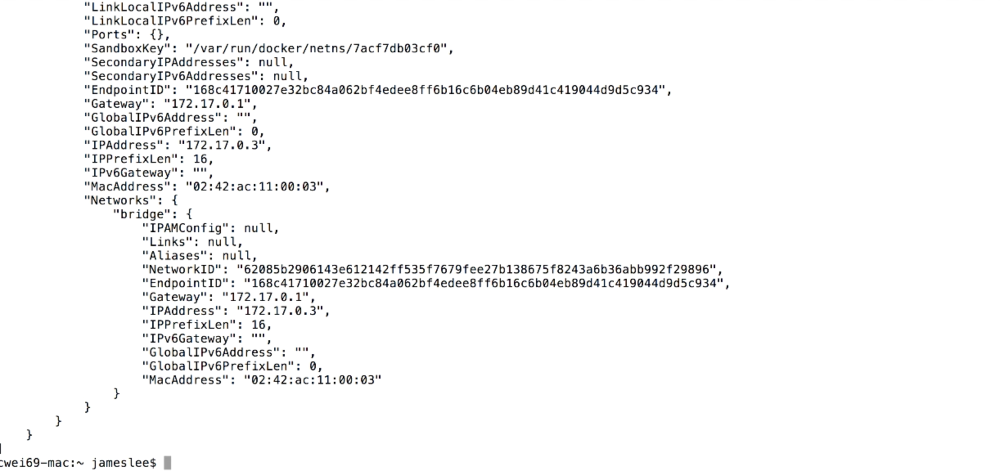

# Docker Commands

## Docker images

Liste l'ensemble des images disponibles sur la machine.

```unix
docker images
```

## Docker run

### Run in Foreground - par défaut

Docker lance le processus dans le container et attache à la console les processus standards d'Input, Output et Error.

```unix
docker run busybox echo "hello world"
=> Créé le container à partir de l'image
=> L'instruction " echo 'hello world' " est executée
=> Le stdout est transmit à la console
=> La console renvoie: hello world
```
### Arrêt automatique du processus

* --rm : Provoque l'arrêt automatique du processus à la fin des instructions

```unix
docker run --rm busybox sleep 1
=> Docker créé le container
=> Execute l'instruction (donc attend 1 seconde)
=> Termine le processus
```
>  Cette option créé le container et execute les commandes associées, puis detruit le container comme s'il n'avait jamais été exécuté

### Spécifier le nom d'un container

Pour qu'un container ne se voit pas attribuer un nom au hasard, on peut utiliser l'option 'name'

* --name : Préciser le nom du container dans les listes

```unix
docker run --name hello-world busybox
=> Crée le container en lui assignant un nom
docker ps -a
=> Renvoie la liste de tous les containers
```


### Autres options

* -i : lance un container interactif
* -t : Crée un pseudo-TTY qui attache stdin et stdout

```unix
docker run -i -t busybox
=> Renvoie le terminal du container monté (grace à -t)
=> Reste dans ce terminal jusqu'à taper "exit" (grace à -i)
```

### Run in background - detached (-d)

Le container est lancé en mode "detached" et le processus se termine une fois les instructions de l'image achevées.

```unix
docker run -d #imageId
=> Le container est créé et lancé en arriere plan
=> La console reçoit le containerId
```

## Docker ps

Liste tous les containers actifs (status: up)

```unix
docker ps
```


### Options

* -a : Retourne aussi les containers dont le processus est terminé

## Docker inspect #containerID

Affiche en json les infos "low level" d'un container.
Par exemple son adresse IP, MAC ou ses ports

```unix
docker inspect #containerID
```

