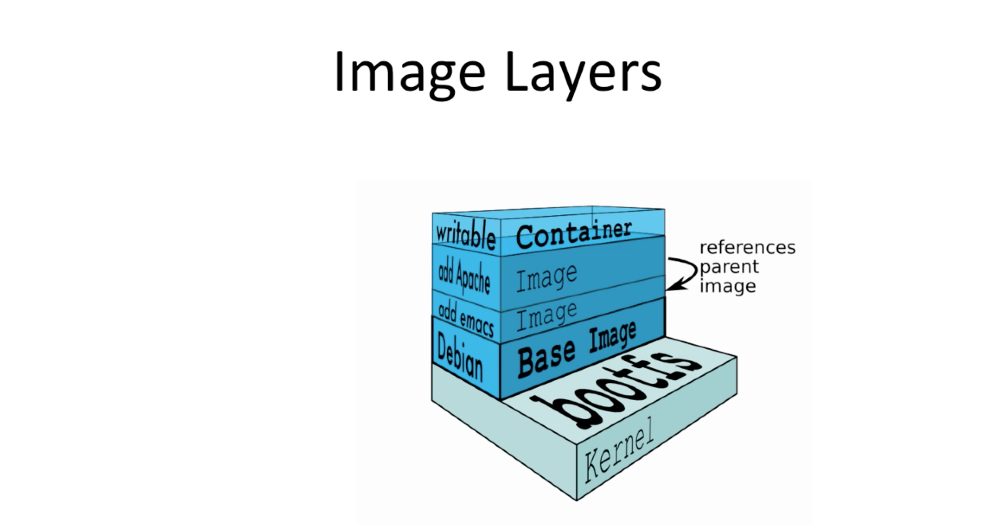
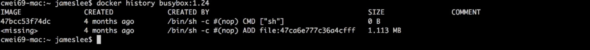
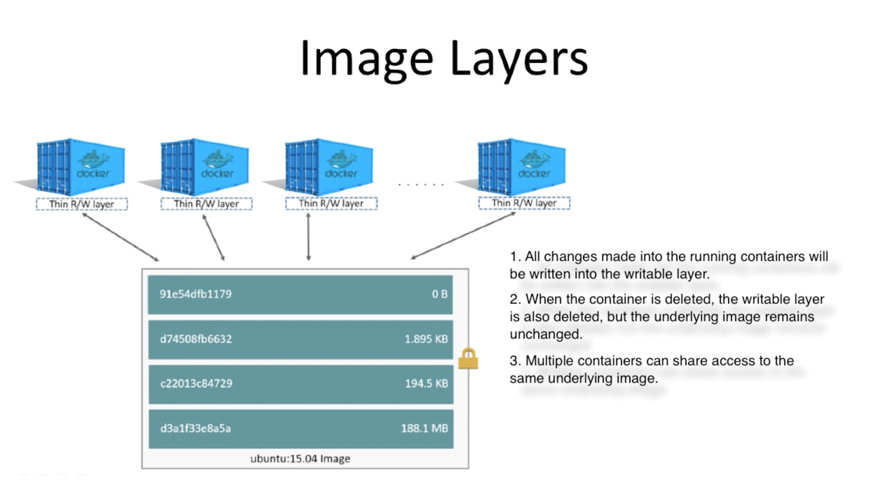
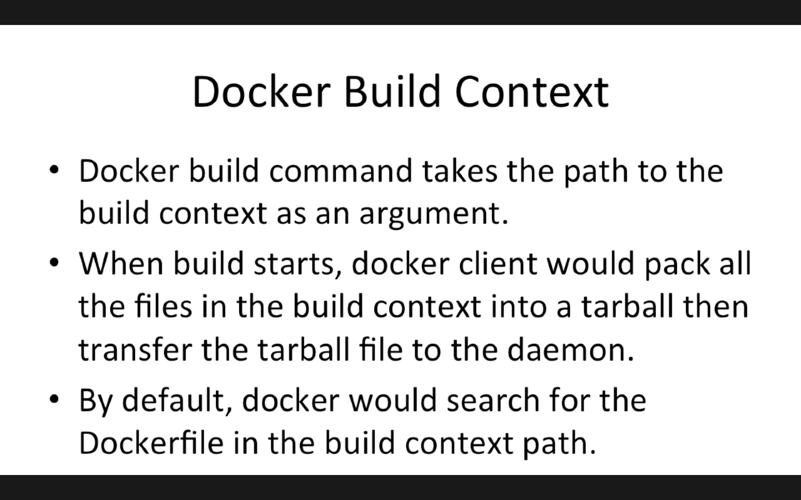
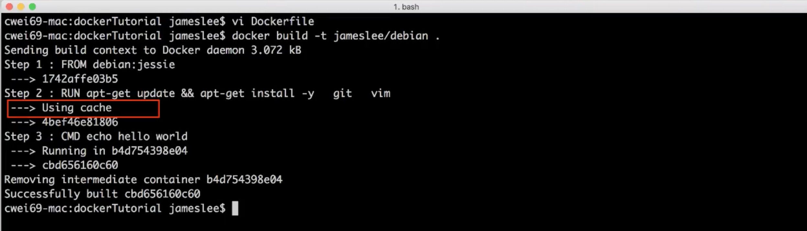

# Images Layer





## Docker History

Cette commande, suivie du nom d'une image, retourne l'intégralité des layers qui la composent.



Lorsqu'un container est lancé, tous les layers sont montés, et ler dernier est le seul disponible en écriture.

Si je lance une image avec docker run, et que je la modifie depuis le terminal, les changements sont enregistés dans le layer Top.

Si je termine un container, la couche superieure est effacé et le prochain montage de l'image réinstalle l'image originale



## Docker Commit or Build

### Une première approche, le commit

Docker Build permet de créer une nouvelle image à partir d'un container (une instance d'image) existant.

```
docker commit containerID (repository/name):(tag)
=> returns the new ID
```

### Utiliser un Dockerfile

* Le Dockerfile contient les instructions pour assembler une image
* Chaque instruction créé un nouveau layer dans l'image
* Les instructionsservent à spécifier quoi faire lors de la construction l'image

Créer un fichier appelé Dockerfile, sans extension, puis ajoutez y les lignes de commandes voulues.

#### DockerFileExemple
```
FROM debian:jessie
RUN apt-get update
RUN apt-get install -y git
RUN apt-get install -y vim

```
Puis dans la console rendez dans le repertoire où vous avez créé ce fichier pour saisir:
```
docker build -t (repository/name):(tag) .
=> returns the new ID
```
* -t : Crée un pseudo-TTY qui attache stdin et stdout
* repoName:tag spécifie où construire l'image
* le '.' indique l'emplacement du Dockerfile à utiliser

## Docker build context



## Docker cache

* Chaque fois que Docker execute une instruction, il construit un image layer.
* Au prochain build, si l'instruction n'a pas changée alors ll'image layer sera ré-utilisé



Pour ne pas utiliser le cache lors du buil, il est possible de passer une option à la commande build.

```
docker build -t (repository/name):(tag) . --no-cache=true
```

## Push images to Docker Hub


```
docker images
=> Renvoie la liste des images et leur id

docker tag #containerId simplon/meteor

docker login --username=simplon
=> Demande le mot de passe

docker push simplon/meteor
```
